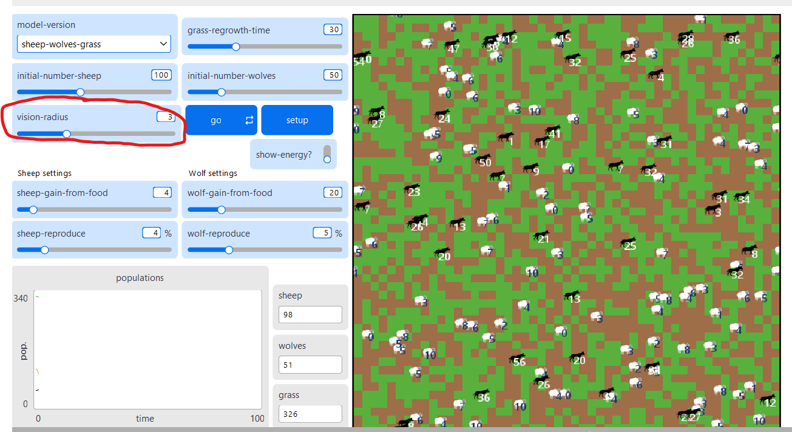
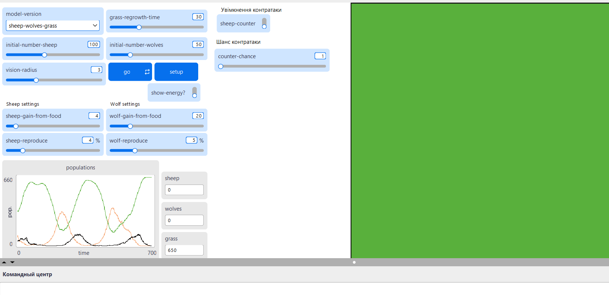
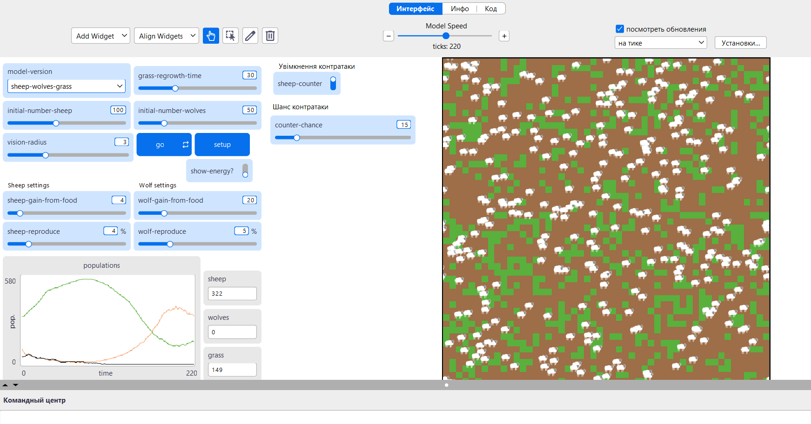

## Комп'ютерні системи імітаційного моделювання
## СПм-24-4, **Чижов Борис Олександрович**
### Лабораторна робота №**2**. Редагування імітаційних моделей у середовищі NetLogo
 

### Варіант 7, модель у середовищі NetLogo:
[Wolf Sheep Predation](https://www.netlogoweb.org/launch#https://www.netlogoweb.org/assets/modelslib/Sample%20Models/Biology/Wolf%20Sheep%20Predation.nlogox)

Прибрати "зграйність" вовків - тепер перед початком свого ходу вовки повинні "оглядатися", перевіряючи оточення, та обирати напрямок руху виходячи з наявності вівець та відсутності інших вовків. Якщо немає іншої можливості – переміщається випадково. При знаходженні на одній ділянці поля двох вовків залишається лише один з них. Вівці переміщаються випадковим чином, але при виявленні вовка на одній із клітин поруч змінюють напрямок на протилежний.

 

### Внесені зміни у вихідну логіку моделі за варіантом:

Виправлення викликів у to **go**, а саме заміна одного універсального правила **move** на окремі **move-sheep** та **move-wolf** оскільки раніше і вовки, і вівці викликали однакову move, тепер робимо дві окремі.

Замість move

<pre>
to move  ; turtle procedure
  rt random 50
  lt random 50
  fd 1
end
</pre>

Робимо окремі правила для овець:

<pre>
to move-sheep
  
  ifelse any? wolves-on neighbors [
    rt 180
    fd 1
  ]
  [
    rt random 50
    lt random 50
    fd 1
  ]
end
</pre>

Та вовків, але добавимо умову, що вовк може пересуватися лише коли одн на клітинці. Якщо вовк один на клітинці то ходить нормально. Якщо в клітинці вже є інший вовк, інший вовк пропускає хід, стоїть і чекає Як тільки один із них піде — другий може знову ходити

<pre>
to move-wolf
  
  ifelse count wolves-here > 1 [
    stop     ]
[
  
  rt random 50
  lt random 50
  fd 1
  ]
end
</pre>

Добавимо функцію, коли вовк перед початком свого ходу буде оглядатися.

<pre>
to look-around-wolf
  let candidate-patches patches in-radius vision-radius with [ any? sheep-here and not any? wolves-here ]
  if any? candidate-patches [
    
    let nearest-min min [ distance myself ] of candidate-patches
    let nearest-patches candidate-patches with [ distance myself = nearest-min ]
    face one-of nearest-patches
  ]
end
</pre>

Також у інтерфейс моделі було додано слайдер із глобальною параметром vision-radius, який буде визначати скільки вовк буде бачити клітинок, коли оглядається.

При значенні vision-radius 1 - воки бачать лише сусідів, при значенні білше 4 вовки полюють на великій дистанції та стають ефективнішими. При значенні 0 вовк ходять випадково.

### Внесені зміни у вихідну логіку моделі, на власний розсуд:

**Додано ймовірність вівцям контратакувати вовків із фіксованою імовірністю**.

Імовірність встановлюється користувачем через інтерфейс середовища моделювання (слайдер для counter-chance) та використовується коли увімкнений перемикач контратаки овець.

Була змінена функція де вовк знаходить вівцю.
Замість
<pre>
to eat-sheep  ; wolf procedure
  let prey one-of sheep-here                    ; grab a random sheep
  if prey != nobody  [                          ; did we get one? if so,
    ask prey [ die ]                            ; kill it, and...
    set energy energy + wolf-gain-from-food     ; get energy from eating
  ]
end
</pre>

Додаємо шанс протидії

<pre>
to eat-sheep
  if any? sheep-here [
    let target one-of sheep-here
    if sheep-counter [
      if (random 100) < counter-chance [
        ask target [ die ]  
        die                 
        stop
      ] 
    ]
    ask target [ die ]
    set energy energy + wolf-gain-from-food
  ]
end
</pre>

**Ключові моменти:**
- Якщо *sheep-counter = off* — все працює як раніше
- Якщо *on* — кожна атака перевіряє шанс
- Якщо шанс спрацює то вовк і вівця помирають одночасно
- Якщо ні — вівця вмирає як завжди, вовк їсть і живе
- Вовк отримує енергію лише якщо вижив.

Фінальний код моделі та її інтерфейс доступні за [посиланням](WSP.nlogox).[посиланням](WSPCode.html) (HTML COde)

 

## Обчислювальні експерименти

### 1. Вплив дальності зору вовкік на ефективність їх полювання та вплив імовірності контратаки на виживання овець в екосистемі.

Екосистема, де у вовків радіус 0 (ходять випадково) і у овець вимкнений шанс контратаки.

Екосистема, де у вовків радіус 3 і у овець вимкнений шанс контратаки. На скріншоті бачимо, вовки бачили овець на великій дистанції, та стали ефективнішими у полюванні, що призвело до зникнення овець, а потім до зникнення вовків.

Екосистема, де у вовків радіус 3 і у овець увімкнений шанс контратаки (15 відсотків). На скріншоті бачимо, вовки бачили овець на великій дистанції, та стали ефективнішими у полюванні, Але церез те що у овець присутня контратака, вони змогли вижити против вовків із зором в 3 клітинки.

